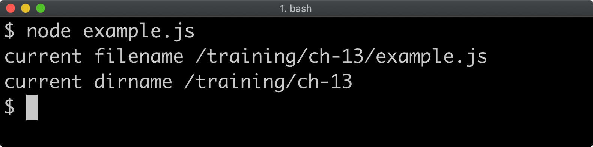
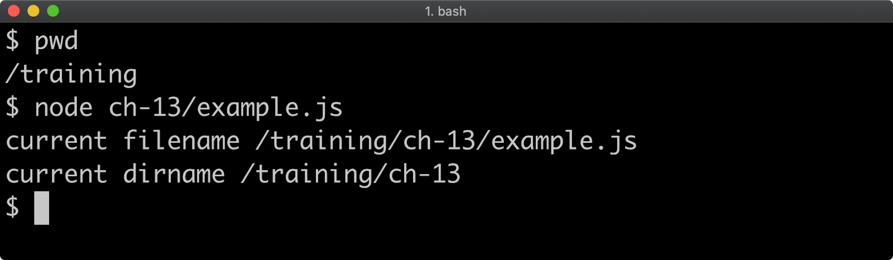
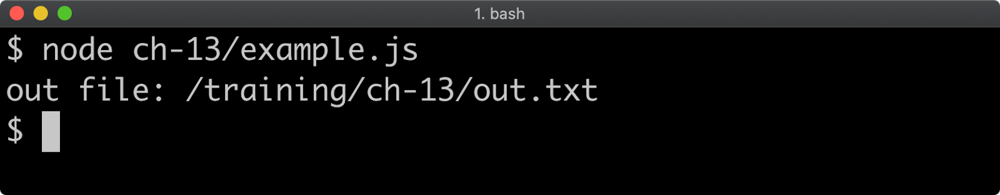
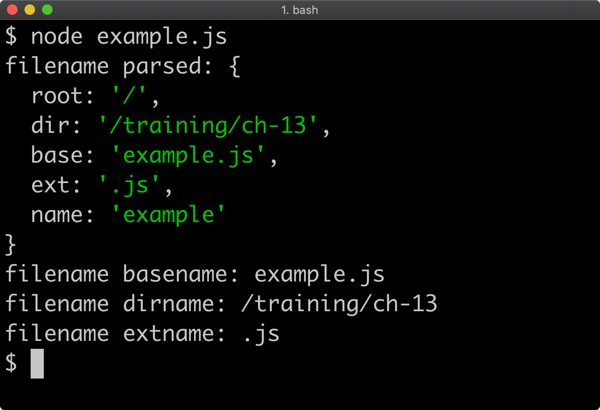

## Contents

* [File Paths (1)](#file-paths-1)
* [File Paths (2)](#file-paths-2)
* [Reading and Writing (1)](#)
* [Reading and Writing (2)](#)
* [Reading and Writing (3)](#)
* [File Streams](#)
* [Reading Directories (1)](#)
* [Reading Directories (2)](#)
* [File Metadata (1)](#)
* [File Metadata (2)](#)
* [Watching (1)](#)
* [Watching (2)](#)

## Overview

* JavaScript was a client-side language, so has no built-in primitives for interacting with the file system.
* The ability to manipulate the file system is central to server-side programming.
* NodeJS provides the `fs` and `path` modules to achieve this.

## Learning Objectives

* Understand path manipulation in Node.
* Query files and directories for meta-data and permissions controls.
* Dynamically respond to file system changes.
* Discover various ways to write files and read files and directories.

---

## File Paths (1)

### `fs` and `path`

Management of the file system is achieved with `fs` and `path`.

The `path` module is important for **path manipulation** and **normalization** across platforms.

The `fs` module provides APIs for: **reading**; **writing**; **file system meta-data**; **file system watching**.

### File Path

**Locating a relative file path:** two variables that are always present in every module: `__filename` and `__dirname`.

The `__filename` variable holds the absolute path **to the currently executing file**, and the `__dirname` variable
holds the absolute path **to the directory** that the currently executing file is in.

### Example

* File at: `/training/ch-13/example.js`

```js title="example.js"
'use strict'

console.log('current filename', __filename)
console.log('current dirname', __dirname)
```

#### Output (1)



If we run the `example.js` file from a different working directory, the output is still the same:

#### Output (2)



Probably the most commonly used method of the path module is the join method. Windows systems use different path
separators to POSIX systems (such as Linux and macOS). For instance a path on Linux or macOS could be
/training/ch-13/example.js whereas on Windows it would be (assuming the path was on drive C), C:
\training\ch-13\example.js. To make matters worse, backslash is the escape character in JavaScript strings so to
represent a Windows path in a string the path would need to be written as C:\\training\\ch-13\\example.js. The path.join
method side-steps these issues by generating a path that's suitable for the platform.

Let's say we want to create a cross-platform path to a file named out.txt that is in the same folder as the file
currently being executed. This can be achieved like so:

'use strict' const { join } = require('path')
console.log('out file:', join(__dirname, 'out.txt'))

Given this code ran in an example.js file located in /training/ch-13 this will print out file: /training/ch-13/out.txt
on macOS and Linux systems:



On a Windows system, assuming the example.js file is located in C:\\training\\ch-13 this will output out file: c:
\\training\ch-13\out.txt on Windows systems.

---

## File Paths (2)

The path.join method can be passed as many arguments as desired, for instance path.join('foo', 'bar', 'baz') will create
the string 'foo/bar/baz' or 'foo\\bar\\baz' depending on platform.

Apart from path.isAbsolute which as the name suggests will return true if a given path is absolute, the available path
methods can be broadly divided into path builders and path deconstructors.

Alongside path.join the other path builders are:

path.relative Given two absolute paths, calculates the relative path between them. path.resolve Accepts multiple string
arguments representing paths. Conceptually each path represents navigation to that path. The path.resolve function
returns a string of the path that would result from navigating to each of the directories in order using the command
line cd command. For instance path.resolve('/foo', 'bar', 'baz') would return '/foo/bar/baz', which is akin to executing
cd /foo then cd bar then cd baz on the command line, and then finding out what the current working directory is.
path.normalize Resolves .. and . dot in paths and strips extra slashes, for instance path.normalize('/foo/../bar//baz')
would return '/bar/baz'. path.format Builds a string from an object. The object shape that path.format accepts,
corresponds to the object returned from path.parse which we'll explore next. The path deconstructors are path.parse,
path.extname, path.dirname and path.basename. Let's explore these with a code example:

'use strict' const { parse, basename, dirname, extname } = require('path')
console.log('filename parsed:', parse(__filename))
console.log('filename basename:', basename(__filename))
console.log('filename dirname:', dirname(__filename))
console.log('filename extname:', extname(__filename))

Given an execution path of /training/ch-13/example.js the following output will be the result on POSIX (e.g.
non-Windows) systems:



On Windows the output would be similar except the root property of the parsed object would contain the drive letter,
e.g. 'C:\\' and both the dir property and the result of the dirname method would return paths with a drive letter and
backslashes instead of forward slashes.

The parse method returns an object with root, dir, base, ext, and name properties. The root and name values can only be
ascertained with the path module by using the parse method. The base, dir and ext properties can be individually
calculated with the path.dirname and path.basename methods respectively.

This section has provided an overview with focus on common usage. Refer to the Node core path Documentation to learn
more.

---

## Reading and Writing (1)

---

## Reading and Writing (2)

---

## Reading and Writing (3)

---

## File Streams

---

## Reading Directories (1)

---

## Reading Directories (2)

---

## File Metadata (1)

---

## File Metadata (2)

---

## Watching (1)

---

## Watching (2)

---